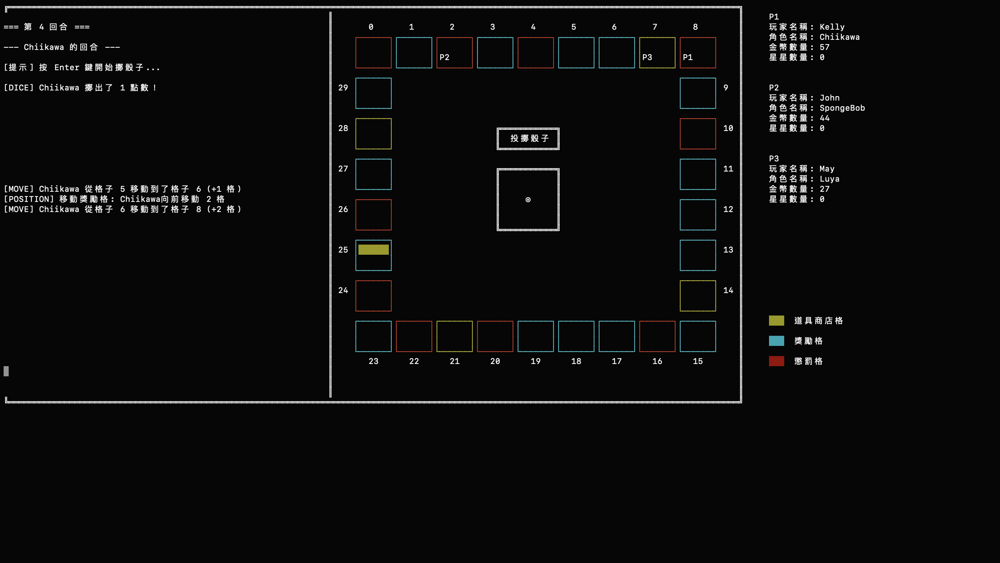

# Monopoly Game in C++

A C++ implementation of a terminal-based multiplayer Monopoly-style game, inspired by *Mario Party*, built using Object-Oriented Programming principles.  
Developed as a group project for the **Programming Design (113-1)** course at NTUIM(National Taiwan University, Dept. of Information Management), which I've taken in year 2 in NTU. 
Team members include **ChienYi Lin (NTU Economics)**, **Hsin-Yun Li (NTU International Business)**, and **Yu-Ting Chou (NTU Political Science)**, led by ChienYi.



---

## Game Overview
This is a multiplayer game played on a circular map with a fixed number of rounds. Each round, players roll a character-specific die and move accordingly.  
The objective is to collect **three super stars** by reaching their location and paying enough coins. Strategic use of items, movement, and interaction is key to winning!  
---
## How to Play

### Character Selection
- Each player selects a character with a unique dice distribution (all dice sum to 21 for fairness).
- Dice behavior reflects the character's traits.

### Game Board
- Circular structure with special tiles:
  - Coin bonus
  - Coin penalty
  - Movement boost or reduction
  - Item shop
- Stars appear randomly; collect them by reaching within 3 tiles and paying coins.

### Win Condition
- First player to collect **3 stars** wins.
- If 20 rounds pass, player with **most stars** wins.

### Item System
Players may purchase and use items strategically:
- **Booster**: Multiply your movement steps.
- **Warp Pipe**: Teleport near the star.
- **Fixed Dice**: Roll guaranteed values (e.g., all 3s).
- **Swap**: Exchange positions with another player.
- **Steal Coins**: Rob another player to gain an advantage.

---

## Class Structure (OOP Design)

| Class        | Description |
|--------------|-------------|
| `Game`       | Main game controller, round logic, player & board management. |
| `Player`     | Handles position, coins, stars, item usage, interactions. |
| `Dice`       | Manages dice face values and rolling. |
| `Character`  | Represents selectable characters and their custom dice. |
| `Tile`       | Represents different types of board tiles with effects. |
| `Item`       | Represents usable items with player effects. |
| `ItemStore`  | Manages item purchasing and display. |
| `GameDisplay`| Handles ASCII visual rendering of board and status. |

### Relationships:
- `Player` inherits from `Character`
- `Tile` and `Item` interact with `Player`
- `GameDisplay` depends on `Player` and `Tile` states
- `Game` orchestrates the entire system

### Notable C++ Features Used
- **Inheritance**: `Player` inherits from `Character` for name and dice attributes
- **Exception Handling**: Input validation in player setup, item selection, etc.
- **Operator Overloading**: `Player` class overrides `>` to compare victory conditions

---

## Design Challenges & Solutions

### `applyEffect` Design
- **Problem**: Where should core interaction logic live?
- **Solution**:  
  - `Tile` handles board effects (coin/movement changes)  
  - `Item` uses function pointers for dynamic effects  
  - `Player` manages internal state changes

### Circular Board Movement
- Initially centralized in `Game`, causing coupling.
- Moved into `Player::move(boardSize)` to ensure correct edge-wrapping for all movement types.

### System Coupling & Extensibility
- High initial coupling between `Item`, `Player`, `Game`.
- **Future plan**: Apply **Strategy Pattern** to item logic, and simplify `Game` as a manager/controller.

### Terminal Display Management
- Managing multiple output zones & cursor control was complex.
- Solution: Created modular display zones with refresh-on-change behavior.

---

## 🛠️ How to Compile

```bash
g++ -std=c++11 sources/*.cpp -o monopoly